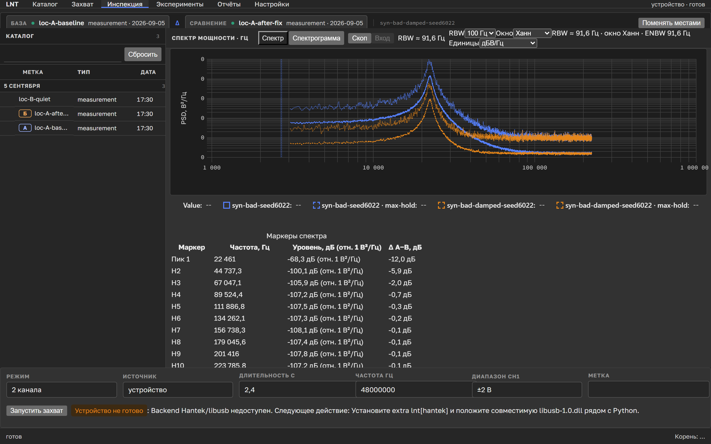

# LNT

**Location Network Tester.** Захват и спектральный анализ питающей сети для
постановки и проверки гипотез об электрическом инпутлаге, сравнения локаций и
условий питания.

*Capture and spectral analysis of mains power for testing hypotheses about
electrical input lag. Russian-language tool, Windows only.*



## О чём это

Есть наблюдение, которое трудно поймать за хвост: одна и та же машина в разных
розетках ощущается по-разному. Играть в одном месте комфортно, в другом мышь
как будто вязнет. Разговоры об этом обычно кончаются спором двух людей, у
которых нет ни одного числа.

LNT даёт числа. Он пишет сигнал питающей сети осциллографом, считает
спектральную плотность мощности и позволяет сравнить две записи между собой:
эту розетку с той, до ремонта проводки с после, вечер с ночью. Инструмент не
объясняет, почему вам некомфортно играть. Он показывает, отличаются ли условия
питания измеримо, и насколько.

Что важно понимать сразу: **связь между электрическими помехами и
воспринимаемым инпутлагом это гипотеза, а не установленный факт.** LNT
построен, чтобы такие гипотезы можно было ставить и проверять, а не чтобы их
подтверждать.

## Быстрый старт без железа

Осциллограф не нужен. LNT умеет генерировать синтетические записи с известной
истиной, и на них можно посмотреть весь тракт за пять минут.

Нужны [uv](https://docs.astral.sh/uv/) и Python 3.12.

```powershell
git clone https://github.com/d1alect-tech/location-network-tester-v2.git
cd location-network-tester-v2
uv sync --python 3.12 --extra ui
```

Сделайте синтетическую сессию и проанализируйте её:

```powershell
$demo = "$env:USERPROFILE\lnt-demo"
uv run lnt simulate --profile bad --out "$demo\syn-bad-seed6022" --seed 6022 --label "розетка-А"
uv run lnt analyze "$demo\syn-bad-seed6022"
uv run lnt ui --root $demo
```

Браузер откроется на `http://127.0.0.1:8765/`. Профили симуляции: `bad`,
`bad-damped` (тот же пик на 22,4 кГц, но на 12 дБ ниже), `quiet`, `sync-only`,
`async-heavy`. Сделайте две сессии разными профилями, откройте «Инспекцию» и
сравните их. Именно так выглядит рабочий цикл, только с настоящими записями
вместо синтетики.

API находит сессию и по имени каталога, и по идентификатору из манифеста
(`session_id`, у синтетики это `syn-<профиль>-seed<семя>`). Каталог показывает
именно идентификатор, так что имя каталога может отличаться — откроется всё равно.

Если у вас есть ИИ-агент с доступом к терминалу, отдайте ему
[`docs/agent-setup.md`](docs/agent-setup.md), там та же установка расписана
по шагам с ожидаемым выводом каждой команды.

## Что нужно для настоящих измерений

Один осциллограф, **Hantek 6022BE**. Под него всё и написано, других устройств
проект не поддерживает. На Авито и подобных площадках он спокойно берётся
до пяти тысяч рублей. Для задачи этого хватает: два канала, 48 МГц выборки,
USB.

Дополнительно понадобится пробник с переключателем 1x/10x (обычно идёт в
комплекте) и, для режима качества сети, трансформатор 230:6.

### Драйвер

Windows не умеет говорить с этим осциллографом из коробки, ему нужен WinUSB.
Ставится один раз утилитой [Zadig](https://zadig.akeo.ie/), в поставку она не
входит и автоматически не скачивается.

1. Поставьте драйвер: `uv sync --python 3.12 --extra hantek`.
2. Положите `libusb-1.0.dll` рядом с `python.exe` вашего окружения.
3. Подключите осциллограф, запустите Zadig, включите `Options` → `List All Devices`.
4. Выберите устройство с VID `04B4` и установите для него WinUSB.
5. Проверьте: `uv run lnt selftest`.

Если после первого захвата устройство «пропало», это нормально. Прошивка
меняет VID на `04B5`, и для нового VID WinUSB надо поставить ещё раз.

Полная версия с картинками и разбором отказов лежит в
[руководстве оператора](docs/operator-guide.md).

## Как считается то, что вы видите

Раздел для тех, кто хочет понять, меряет ли эта штука что-то осмысленное.

**Спектральная плотность мощности** считается методом Уэлча с окном Ханна.
Уровни выражены в дБ относительно `1 В²/Гц`, и эта опорная единица подписана в
интерфейсе рядом с каждым числом, чтобы её нельзя было спутать с дБм или дБВ.
Разрешающая полоса `RBW` равна `1.5 × resolution_hz`, где `resolution_hz` это
шаг сетки частот. Множитель 1,5 берётся из эквивалентной шумовой полосы окна
Ханна, а не выбран на глаз.

**Перевод отсчётов АЦП в вольты** живёт ровно в одном месте, модуле
`lnt.adc_calibration`. Второго источника истины в проекте нет намеренно: пока
их было два, они разъезжались.

**Полоса анализа CH1** это от 3 кГц до `min(3 МГц, 0.45 × fs)`. Ниже 3 кГц
доминируют сеть и её гармоники, выше начинается зона, где пробник и вход АЦП
врут больше, чем измеряемый сигнал.

**Длительность записи** не меньше 100 периодов сети, по умолчанию 2,4 секунды
при 50 Гц. Короче нельзя, команда завершится с кодом 2.

**Сравнивать нужно дельты, а не абсолютные значения.** Перед серией измерений в
локации снимите базовую запись самошума с терминированными входами
(`--self-noise`). Абсолютный уровень зависит от пробника, длины проводов и
положения рук, дельта между двумя записями одной сессии зависит от них
существенно меньше.

## Формат сессии

```
<сессия>/
  manifest.json                # схема v1 для синтетики, v2 для аппаратного захвата
  ch1.npy                      # float32, вольты, ВЧ-пробник
  ch2.npy                      # float32, вольты, трансформатор 50 Гц
  metrics.json                 # метрики иголок, пики спектра, приведение ко входу
  spectrum.csv                 # сырой PSD в плоскости осциллографа
  spectrum_input_referred.csv  # приведённый ко входу избыточный PSD, если доступен
```

Запись атомарна. Сессия на диске либо целиком, либо её нет: сначала каталог
`.partial-*`, потом переименование.

`spectrum.csv` всегда остаётся сырым и никогда не выдаётся за приведённые ко
входу данные. Если приведение недоступно, `metrics.json` говорит об этом
машиночитаемо, полем `ch1_input_reference.reason_code`.

## Разработка

```powershell
uv run --python 3.12 pytest -q
uv run --python 3.12 ruff check .
uv run --python 3.12 basedpyright
cd frontend; npm run test; npm run typecheck; npm run build
```

Правила, по которым живёт код: каждый модуль начинается с падающего теста,
чистый размер модуля не больше 250 строк и проверяется тестом
`tests/test_module_size.py`, исключения перечислены поимённо в леджере внутри
этого же теста и обязаны рано или поздно оттуда уйти.

Проектная документация: [домен и термины](docs/agents/domain.md),
[архитектурные решения](docs/adr/), [научное руководство](docs/scientific-manual.md),
[дорожная карта](docs/roadmap.md).

## Лицензия

MIT, текст в [LICENSE](LICENSE).

Опциональный extra `lnt[hantek]` тянет драйвер Hantek6022API под
GPL-3.0-or-later. Кода этого драйвера в репозитории нет, он скачивается из
upstream при установке, импорт ленивый. Границы распространения, включая
условие про бинарные сборки с драйвером внутри, описаны в
[политике распространения](docs/distribution-policy.md). Полный инвентарь
зависимостей с лицензиями и хешами лежит в
[THIRD_PARTY_NOTICES.md](THIRD_PARTY_NOTICES.md).
